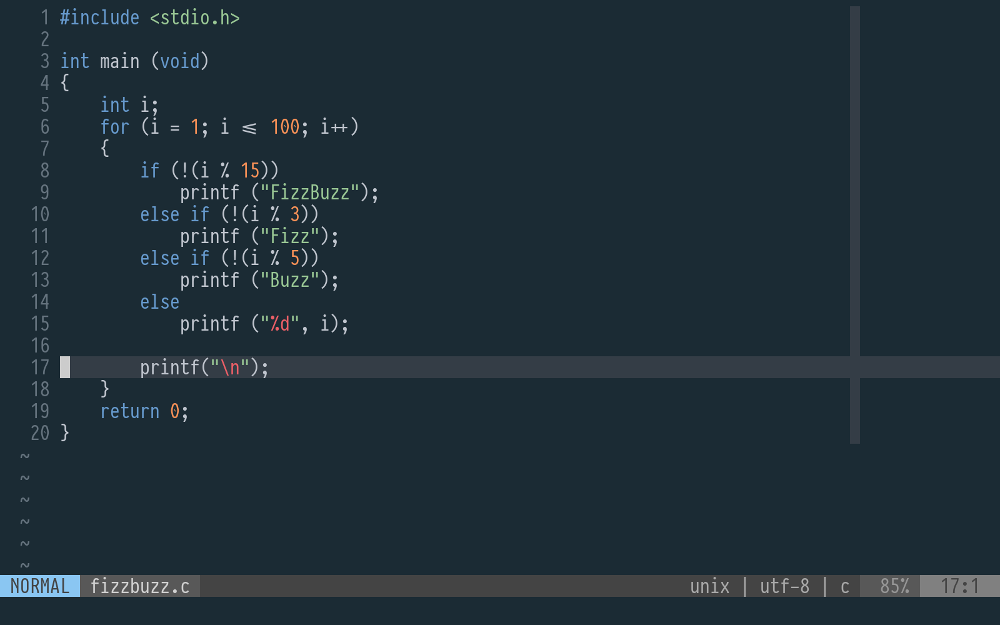

# Oceanic Primal theme for Vim and Neovim

**Not** [base16](http://chriskempson.com/projects/base16/) theme: less colors, more oceanic

Minimalistic theme based on [Oceanic Primal palette](https://github.com/oceanic-primal/palette), inspired by [Oceanic-Next.vim](https://github.com/mhartington/oceanic-next).

Supported plugins

* [vim-gitgutter](https://github.com/airblade/vim-gitgutter)
* [coc](https://github.com/neoclide/coc.nvim)

