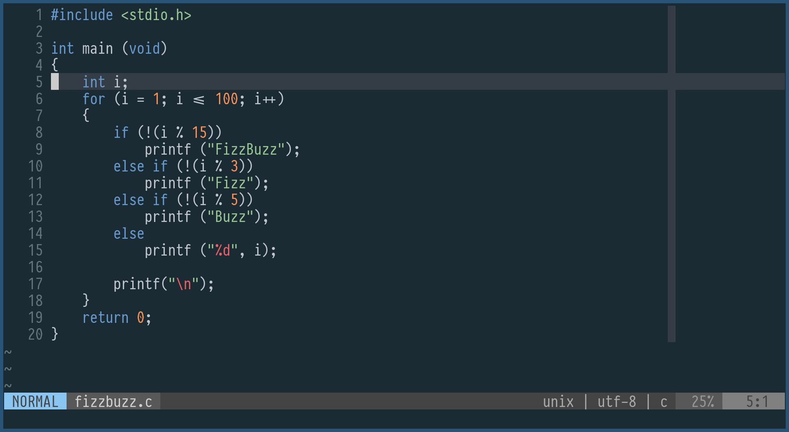
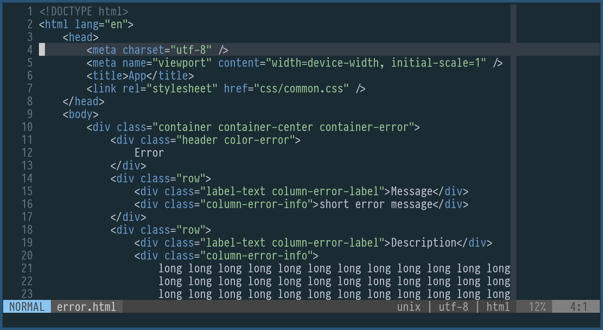
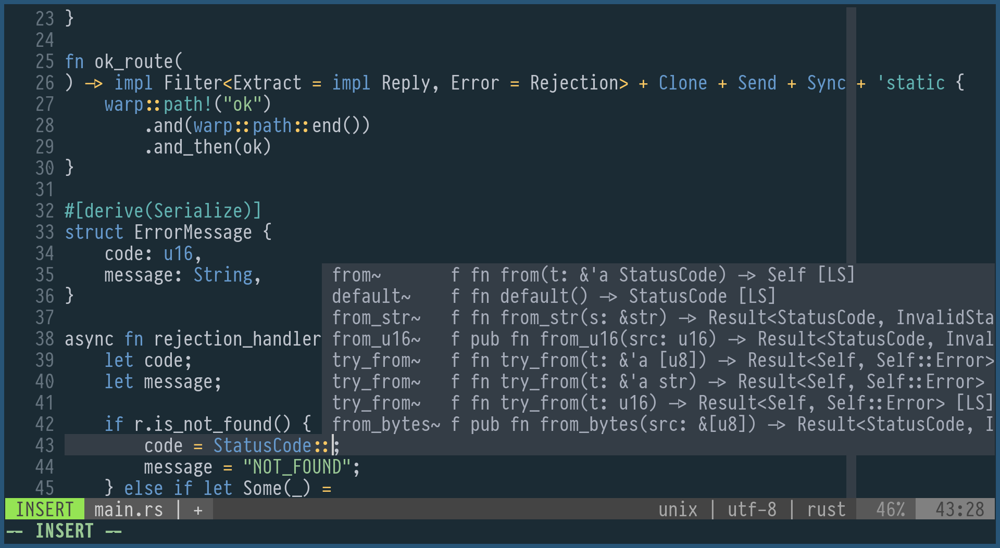

# Oceanic Primal theme for Vim and Neovim

**Not** [base16](http://chriskempson.com/projects/base16/) theme: fewer color, more ocean

A minimalistic theme based on [Oceanic Primal palette](https://github.com/oceanic-primal/palette), inspired by [Oceanic-Next.vim](https://github.com/mhartington/oceanic-next).

Supported plugins

-   [vim-gitgutter](https://github.com/airblade/vim-gitgutter)
-   [coc](https://github.com/neoclide/coc.nvim)

Font on screenshot is [PragmataPro](https://fsd.it/shop/fonts/pragmatapro/)

-   [Oceanic Primal for IntelliJ IDEA](https://github.com/barlog-m/oceanic-primal-idea)
-   [Oceanic Primal for other programs](https://github.com/barlog-m/oceanic-primal)
